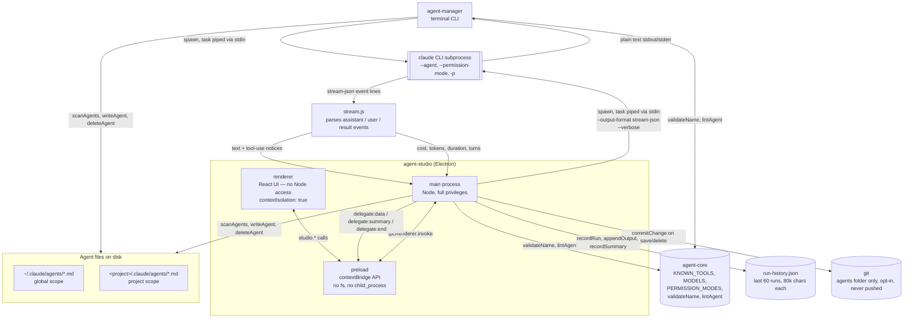

# Claude Agent Toolkit

Tools for managing Claude Code subagents — a shared vocabulary package, a terminal
dashboard, and a desktop app, all reading and writing the same `.claude/agents/`
files.

## Packages

| Package | What it is |
| --- | --- |
| [`agent-core`](./agent-core) | Shared vocabulary — tool list, model list, permission modes, name rules, lint. Used by both apps below so they can't drift apart. |
| [`agent-manager`](./agent-manager) | An interactive terminal dashboard for browsing, creating, editing, and delegating to subagents. Linked globally via `npm link`. |
| [`agent-studio`](./agent-studio) | A desktop app (Electron) for the same job — one card per agent, live delegation with streamed output, cost/token tracking per run, and optional git-backed versioning of the agents folder. |

Both `agent-manager` and `agent-studio` depend on `agent-core` as a local
`file:` dependency, so agent definitions, tool/model lists, and validation stay
in sync between the CLI and the desktop app.

See each package's own README for setup and usage.

## Architecture

Both front ends read and write the same `.claude/agents/*.md` files and share
`agent-core` for the vocabulary that has to stay identical between them —
tool list, model list, permission modes, name validation, and lint warnings.
The only thing that differs is how each one talks to the `claude` CLI:
`agent-manager` streams plain text straight to the terminal, while
`agent-studio` requests structured `stream-json` output so its main process
can pull out per-run cost and token usage, then relay everything to the
renderer over IPC.

### Delegating a task

1. Pick an agent, type a task, and choose a working directory and permission
   mode — in the CLI's prompts, or Studio's delegate panel and native folder
   picker.
2. The app spawns `claude --agent <name> --permission-mode <mode> -p`, adding
   `--output-format stream-json --verbose` only in `agent-studio`. The task
   text goes over the child process's **stdin**, not argv — on Windows
   `claude` is a `.cmd` shim that needs `shell: true`, and that code path
   does not quote arguments, so a task containing spaces or `& | < >` would
   otherwise break the command line.
3. `agent-manager` streams stdout/stderr straight to the terminal as it
   arrives.
4. `agent-studio` instead gets newline-delimited JSON events. `stream.js`
   turns `assistant` text blocks into console lines, turns `tool_use` blocks
   into `⚙ ToolName` notices, drops `thinking` blocks (they're long and bury
   the answer), and reads cost/tokens/duration/turn count off the terminal
   `result` event — the only place the CLI reports `total_cost_usd`.
5. The main process forwards each chunk to the renderer over IPC
   (`delegate:data`), the final summary (`delegate:summary`), and persists
   the whole run to `run-history.json`, capped at 60 runs and 80k characters
   of output each.

### Creating or editing an agent

1. A create/edit form — CLI prompts, or Studio's `AgentEditor` — collects
   name, description, tags, scope, model, tool allowlist, and persona.
2. `agent-core`'s `validateName` enforces kebab-case (the name doubles as the
   `subagent_type`), and `lintAgent` returns non-blocking warnings: a
   description under 25 characters, a description that doesn't say *when* to
   use the agent, an empty persona, leftover `<angle-bracket>` placeholders
   from the scaffold, or an empty tool list.
3. `writeAgent` serializes the result to YAML frontmatter plus the persona
   body — omitting `tools` when set to "all tools" and `model` when set to
   "inherit", so Claude Code's own defaults apply. Both apps encode this
   identically, since both import `agent-core`.
4. The file is written to `~/.claude/agents/<name>.md` (global scope) or
   `<project>/.claude/agents/<name>.md` (project scope — the folder is
   whatever's currently selected).
5. If versioning is enabled, `agent-studio` also runs `commitChange` against
   that scope's folder. Versioning is opt-in and local: pressing **Track**
   runs `git init` scoped to the agents folder, writes a `.gitignore`
   limiting history to `*.md`, and auto-commits every save and delete after
   that. Nothing is ever pushed — there's no remote unless one is added by
   hand, and commit failures are swallowed deliberately so versioning can
   never be the reason a save fails.
