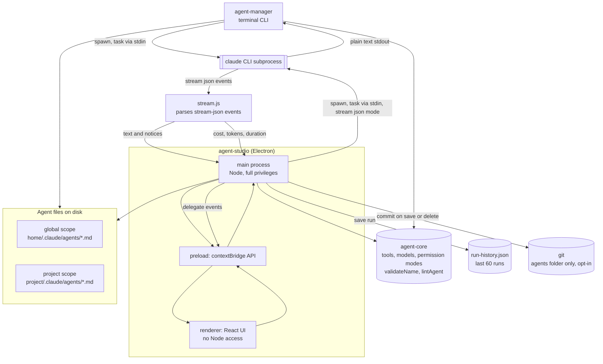
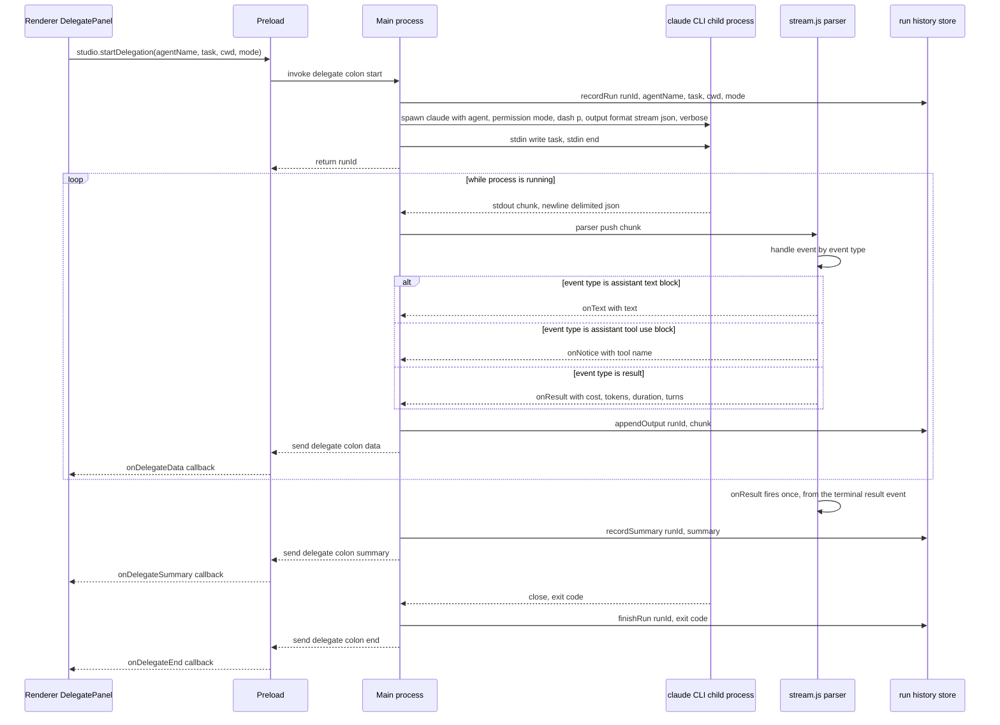
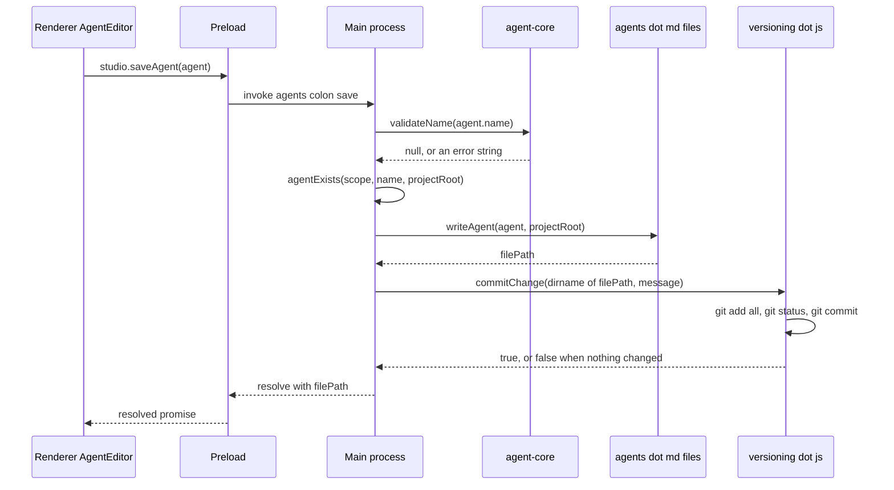

# Claude Agent Toolkit

Tools for managing Claude Code subagents — a shared vocabulary package, a terminal
dashboard, and a desktop app, all reading and writing the same `.claude/agents/`
files.

## Packages

| Package | What it is |
| --- | --- |
| [`agent-core`](./agent-core) | Shared vocabulary — tool list, model list, permission modes, name rules, lint. Used by both apps below so they can't drift apart. |
| [`agent-manager`](./agent-manager) | An interactive terminal dashboard for browsing, creating, editing, and delegating to subagents. Linked globally via `npm link`. |
| [`agent-studio`](./agent-studio) | A desktop app (Electron) for the same job — one card per agent, live delegation with streamed output, cost/token tracking per run, and optional git-backed versioning of the agents folder. |

Both `agent-manager` and `agent-studio` depend on `agent-core` as a local
`file:` dependency, so agent definitions, tool/model lists, and validation stay
in sync between the CLI and the desktop app.

See each package's own README for setup and usage.

## Architecture

Both front ends read and write the same `.claude/agents/*.md` files and share
`agent-core` for the vocabulary that has to stay identical between them —
tool list, model list, permission modes, name validation, and lint warnings.
The only thing that differs is how each one talks to the `claude` CLI:
`agent-manager` streams plain text straight to the terminal, while
`agent-studio` requests structured `stream-json` output so its main process
can pull out per-run cost and token usage, then relay everything to the
renderer over IPC.



### Delegating a task

1. Pick an agent, type a task, and choose a working directory and permission
   mode — in the CLI's prompts, or Studio's delegate panel and native folder
   picker.
2. The app spawns `claude --agent <name> --permission-mode <mode> -p`, adding
   `--output-format stream-json --verbose` only in `agent-studio`. The task
   text goes over the child process's **stdin**, not argv — on Windows
   `claude` is a `.cmd` shim that needs `shell: true`, and that code path
   does not quote arguments, so a task containing spaces or `& | < >` would
   otherwise break the command line.
3. `agent-manager` streams stdout/stderr straight to the terminal as it
   arrives.
4. `agent-studio` instead gets newline-delimited JSON events. `stream.js`
   turns `assistant` text blocks into console lines, turns `tool_use` blocks
   into `⚙ ToolName` notices, drops `thinking` blocks (they're long and bury
   the answer), and reads cost/tokens/duration/turn count off the terminal
   `result` event — the only place the CLI reports `total_cost_usd`.
5. The main process forwards each chunk to the renderer over IPC
   (`delegate:data`), the final summary (`delegate:summary`), and persists
   the whole run to `run-history.json`, capped at 60 runs and 80k characters
   of output each.

### Creating or editing an agent

1. A create/edit form — CLI prompts, or Studio's `AgentEditor` — collects
   name, description, tags, scope, model, tool allowlist, and persona.
2. `agent-core`'s `validateName` enforces kebab-case (the name doubles as the
   `subagent_type`), and `lintAgent` returns non-blocking warnings: a
   description under 25 characters, a description that doesn't say *when* to
   use the agent, an empty persona, leftover `<angle-bracket>` placeholders
   from the scaffold, or an empty tool list.
3. `writeAgent` serializes the result to YAML frontmatter plus the persona
   body — omitting `tools` when set to "all tools" and `model` when set to
   "inherit", so Claude Code's own defaults apply. Both apps encode this
   identically, since both import `agent-core`.
4. The file is written to `~/.claude/agents/<name>.md` (global scope) or
   `<project>/.claude/agents/<name>.md` (project scope — the folder is
   whatever's currently selected).
5. If versioning is enabled, `agent-studio` also runs `commitChange` against
   that scope's folder. Versioning is opt-in and local: pressing **Track**
   runs `git init` scoped to the agents folder, writes a `.gitignore`
   limiting history to `*.md`, and auto-commits every save and delete after
   that. Nothing is ever pushed — there's no remote unless one is added by
   hand, and commit failures are swallowed deliberately so versioning can
   never be the reason a save fails.

## Low-Level Design

The diagrams above show *what* talks to *what*. This section shows the exact
call sequence, wire formats, and on-disk/IPC data shapes behind
`agent-studio`, taken directly from `src/main/index.js`, `stream.js`,
`agents.js`, `history.js`, and `versioning.js`.

### Sequence: delegating a task



Notes that don't fit in the diagram:

- `onResult` is intentionally the odd one out — every other callback fires
  per stream chunk, but the CLI reports cost and token usage exactly once,
  in the terminal `result` event, so `delegate:summary` fires once per run
  regardless of how many `delegate:data` chunks preceded it.
- `thinking` content blocks are matched in `stream.js`'s `switch` but never
  call `onText` or `onNotice` — they're read and discarded on purpose.
- A `tool_result` block with `is_error: true` (an `event.type === "user"`
  event) produces a `⚠ tool call failed` notice, but does not stop the run —
  only the process closing does.

### Sequence: saving an agent



`commitChange` returns `false` without erroring when the folder isn't a git
repo *or* when `git status --porcelain` comes back empty — versioning is
best-effort by design, so a failed or skipped commit never surfaces as a
save failure.

### Data shapes

In-memory agent object — the shape both `agent-manager` and `agent-studio`
read from disk and write back (`agents.js` in each package):

```js
{
  name: string,          // kebab-case; doubles as the subagent_type
  description: string,   // required — this is the router's matching signal
  tools: string[] | null,// null means "all tools" (omitted from frontmatter)
  tags: string[],        // a toolkit-only key; Claude Code ignores it
  model: "inherit" | "opus" | "sonnet" | "haiku" | "fable",
  body: string,           // persona / system prompt, trimmed
  filePath: string,
  scope: "user" | "project",
  broken?: string,        // set instead of the above if the .md failed to parse
}
```

What actually lands on disk (YAML frontmatter via `gray-matter`) — keys are
*omitted*, not written as empty, when they'd otherwise take their default:

```yaml
---
name: api-guardian
description: Use when reviewing API changes for backward compatibility.
tools: Read, Grep, Bash        # omitted entirely for "all tools"
tags: review, api               # omitted when there are no tags
model: sonnet                   # omitted for "inherit"
---

<persona body, trimmed>
```

One run in `run-history.json` (array, capped at 60 entries, newest first):

```js
{
  runId: string,          // `run-${Date.now()}-${sequence}`
  agentName: string,
  task: string,
  cwd: string,
  mode: "default" | "plan" | "acceptEdits" | "bypassPermissions",
  startedAt: number,      // epoch ms
  finishedAt: number | null,
  exitCode: number | null,
  output: string,          // capped at 80,000 characters
  truncated: boolean,
  summary: {
    costUsd: number | null,     // null if the run never reached a result event
    durationMs: number | null,
    numTurns: number | null,
    isError: boolean,
    sessionId: string | null,
    usage: { input: number, output: number, cacheRead: number, cacheWrite: number },
    models: string[],
  } | null,
}
```

### IPC channel contract

Every channel the preload script exposes, and the shape crossing it. All
`invoke`-style channels are request/response; the last four are one-way
`main → renderer` events pushed during a run.

| Channel | Kind | In | Out |
| --- | --- | --- | --- |
| `meta:get` | invoke | — | `{ tools, models, permissionModes, globalDir, projectRoot, projectDir, recentProjects, claude }` |
| `claude:recheck` | invoke | — | `{ checked, available, version }` |
| `agents:list` | invoke | — | `Agent[]` |
| `agents:save` | invoke | `Agent` | `filePath` |
| `agents:delete` | invoke | `filePath` | `true` |
| `agents:reveal` | invoke | `filePath` | — |
| `project:pick` / `project:use` / `project:clear` | invoke | `root?` | `projectRoot \| null` |
| `dir:pick` | invoke | `defaultPath?` | `path \| null` |
| `history:list` / `history:get` / `history:clear` / `history:totals` | invoke | `agentName? \| runId` | run meta`[]` / run / `true` / totals |
| `vcs:status` / `vcs:init` / `vcs:log` / `vcs:diff` / `vcs:revert` | invoke | `scope \| filePath \| hash` | status / commit log / diff text / `true` |
| `delegate:start` | invoke | `{ agentName, task, cwd, mode }` | `runId` |
| `delegate:stop` | invoke | `runId` | `boolean` |
| `delegate:data` | event | — | `{ runId, chunk, stderr, notice }` |
| `delegate:summary` | event | — | `{ runId, costUsd, durationMs, numTurns, isError, sessionId, usage, models }` |
| `delegate:end` | event | — | `{ runId, code }` |
| `claude:status` | event | — | `{ checked, available, version }` |
